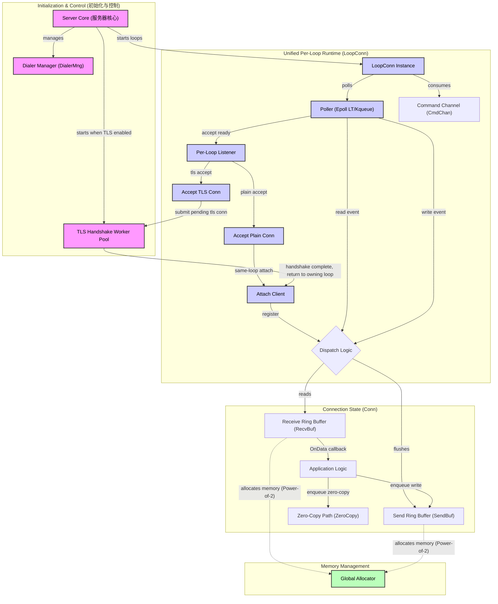

# Connaxis Library Architecture Design

This diagram shows the high-level architecture of the `connaxis` library.

Notes:
- This diagram focuses on the unified per-loop runtime, the TLS handshake offload path, and memory-management paths, and does not expand the `atls / ktls` TLS engine branches.
- The kTLS path is an optional acceleration implementation in the connection layer; whether it is used depends on runtime environment and negotiated parameters (see `design/ktls_status_and_roadmap.en.md`).

### Component Details

1. **Server (Core)**
   - Main entry point of the program. Initializes multiple `LoopConn` instances and binds listeners to every loop.
   - Starts the TLS handshake worker pool when TLS mode is enabled.
   - Manages outbound connections through `DialerMng`, enabling client-mode scenarios.

2. **LoopConn**
   - Each loop owns its own listener set and directly handles accept, read, write, and close for its connections.
   - The runtime uses `SO_REUSEPORT` fan-out instead of a central acceptor redispatching accepted sockets.
   - Plain TCP connections are attached in the same loop immediately after accept.
   - TLS connections create a pending TLS connection object first, then enter the TLS handshake worker pool.

3. **TLS Handshake Worker Pool**
   - Offloads server-side TLS handshakes from the loop hot path.
   - Uses `TlsHandshakeWorkers` and `TlsHandshakeMaxPending` to bound concurrent and queued handshakes.
   - On handshake success, the connection is attached back to the original accept loop.

4. **Loop runtime details**
   - **Poller**: waits for I/O events using **Level Triggered (LT)** `epoll`/`kqueue`.
   - **Channels**:
     - `CmdChan`: receives async commands from user code or other goroutines (for example `Write`, `Close`)
   - **Flow Control**: built-in limits such as `MaxRead/Write/Cmd` prevent one connection from starving the entire loop.
   - **TLS path**: the connection layer may run on the async TLS path (`atls`) or the Linux kTLS path while keeping the upper callback model as consistent as possible.

5. **Connection (State)**
   - Each connection maintains its own `RecvBuf` and `SendBuf` (both implemented as ring buffers).
   - **Zero-Copy**: supports passing `owner` buffers allocated by `GAllocator` directly to user code or directly enqueueing them for sends, reducing memory copies.

6. **Global Allocator**
   - A size-classed memory pool built on `sync.Pool`.
   - Uses a **Power-of-2** strategy (1k, 2k, 4k...) to significantly reduce GC pressure in high-frequency I/O scenarios.
