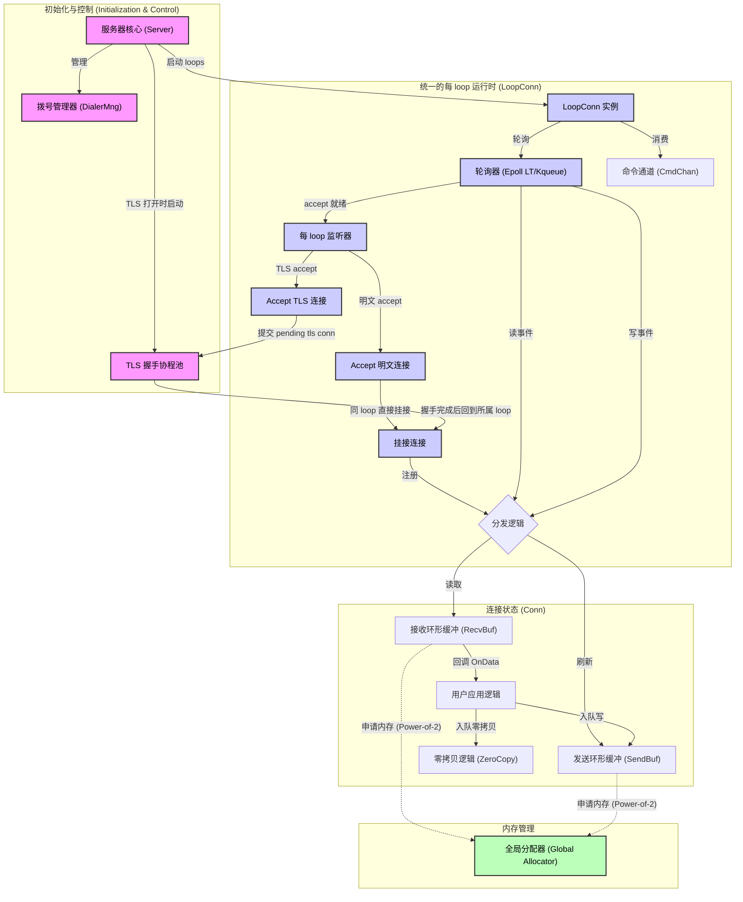

# Connaxis 库架构设计

本图展示了 `connaxis` 库的高层架构设计。

说明：
- 本图聚焦统一的 per-loop 运行模型、TLS 握手卸载路径以及内存管理主路径，未展开 `atls / ktls` TLS 引擎分支细节。
- kTLS 路径属于连接层的可选加速实现，实际是否启用取决于运行环境与协商结果（详见 `design/ktls_status_and_roadmap.zh.md`）。

### 组件详细说明

1. **Server（服务器核心）**
   - 程序的主入口。负责初始化多个 `LoopConn`，并给每个 loop 绑定 listener。
   - 在 TLS 模式下，会启动 TLS 握手协程池。
   - 通过 `DialerMng` 管理外拨连接，支持客户端模式。

2. **LoopConn**
   - 每个 loop 都持有自己的一组 listener，并直接负责连接的 accept、读、写、关闭。
   - 运行时依赖 `SO_REUSEPORT` 做接入分流，而不是单个中心 acceptor 收到连接后再分发。
   - 明文连接在 accept 后直接在本 loop 挂接。
   - TLS 连接在 accept 后先创建 pending TLS 连接对象，再进入 TLS 握手协程池。

3. **TLS 握手协程池**
   - 将服务端 TLS 握手从 loop 热路径中卸载出来。
   - 通过 `TlsHandshakeWorkers` 和 `TlsHandshakeMaxPending` 控制并发握手数和排队上限。
   - 握手成功后，把连接回挂到原始 accept loop。

4. **Loop 运行时细节**
   - **Poller**：使用 **Level Triggered（水平触发）** 的 `epoll`/`kqueue` 等待 I/O 事件。
   - **Channels**:
     - `CmdChan`：接收来自用户层或其他 Goroutine 的异步指令（如 `Write`, `Close`）
   - **Flow Control**：内置了 `MaxRead/Write/Cmd` 等多个流控参数，防止单个连接饿死整个 Loop。
   - **TLS Path**：连接层可能运行在异步 TLS（`atls`）或 Linux kTLS 路径上；对上层回调模型保持尽量一致。

5. **Connection（连接状态）**
   - 每个连接维护独立的 `RecvBuf` 和 `SendBuf`（均为 RingBuffer 实现）。
   - **Zero-Copy**：支持直接将 `GAllocator` 分配的 `owner` buffer 传递给用户，或者直接入队发送，减少内存拷贝。

6. **Global Allocator（全局分配器）**
   - 基于 `sync.Pool` 的分级内存池。
   - 采用 **Power-of-2（2 的幂次）** 策略（1k, 2k, 4k...），极大降低了高频 I/O 场景下的 GC 压力。
