# Performance Charts

### TCP Throughput (conns=5000, payload=128)

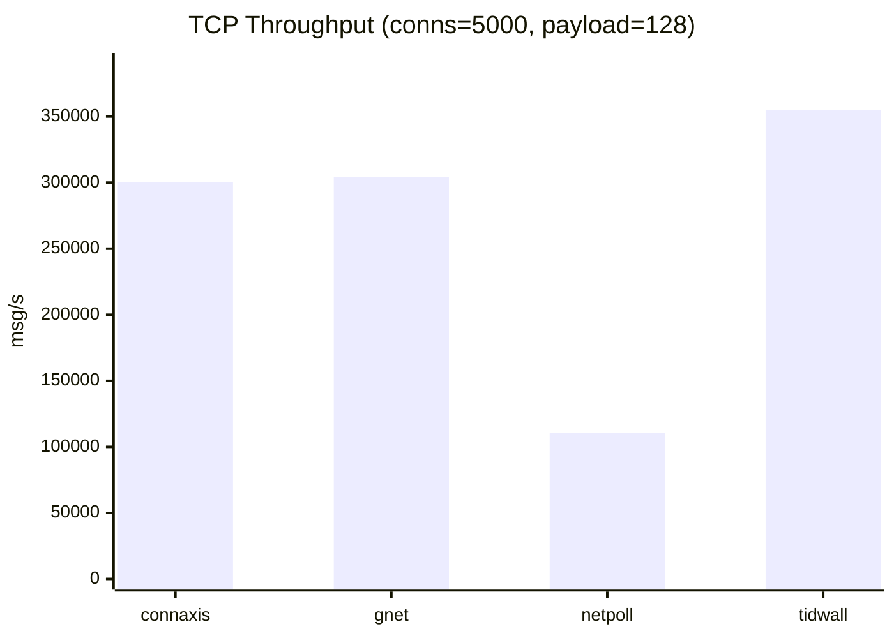
```mermaid
xychart-beta
    title "TCP Throughput (conns=5000, payload=128)"
    x-axis [connaxis, gnet, netpoll, tidwall]
    y-axis "msg/s" 0 --> 390484
    bar [300313, 304106, 110663, 354984]
```

### TCP Throughput (conns=5000, payload=512)

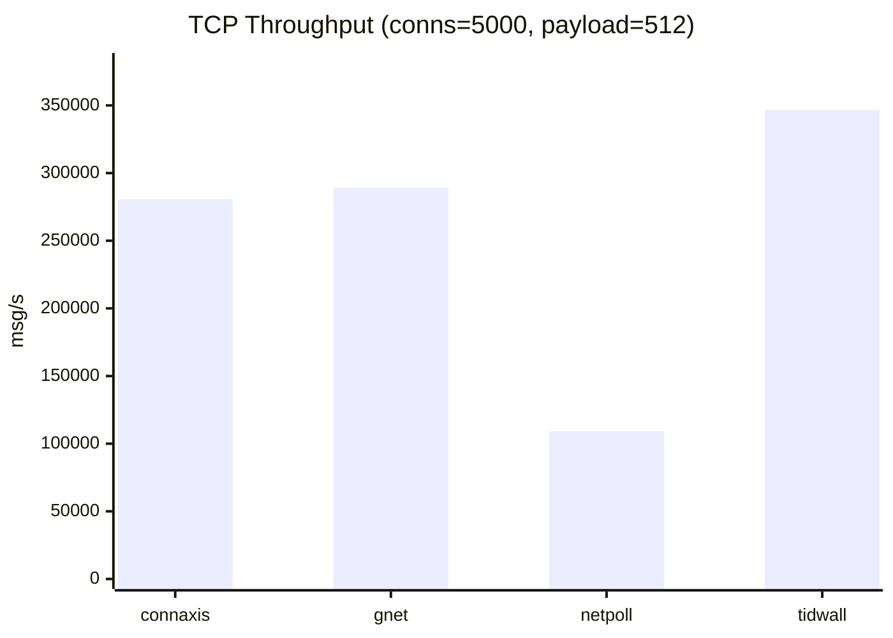
```mermaid
xychart-beta
    title "TCP Throughput (conns=5000, payload=512)"
    x-axis [connaxis, gnet, netpoll, tidwall]
    y-axis "msg/s" 0 --> 381297
    bar [280644, 289170, 109194, 346632]
```

### TCP P99 (conns=5000, payload=128)

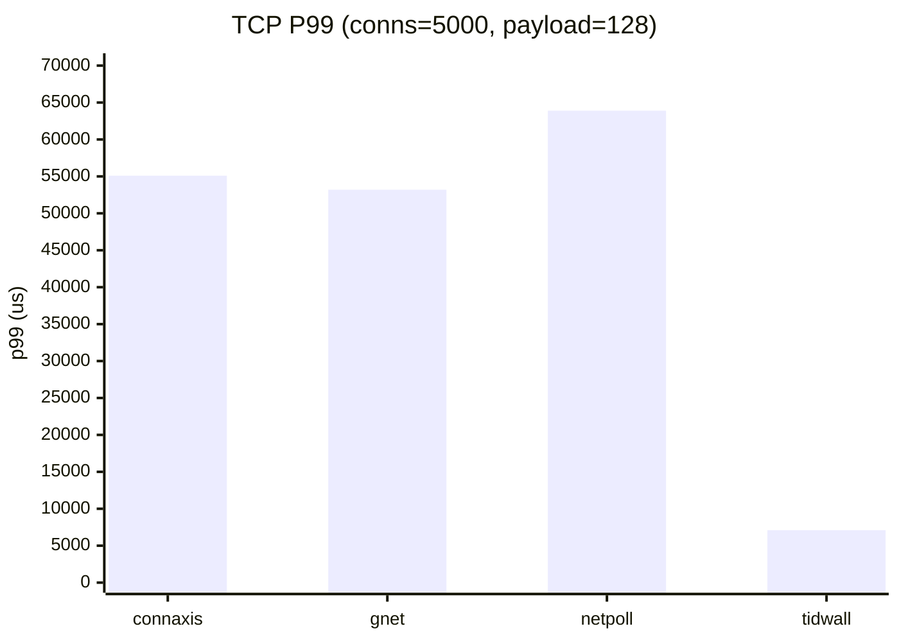
```mermaid
xychart-beta
    title "TCP P99 (conns=5000, payload=128)"
    x-axis [connaxis, gnet, netpoll, tidwall]
    y-axis "p99 (us)" 0 --> 70290
    bar [55100, 53200, 63900, 7100]
```

### TCP P99 (conns=5000, payload=512)

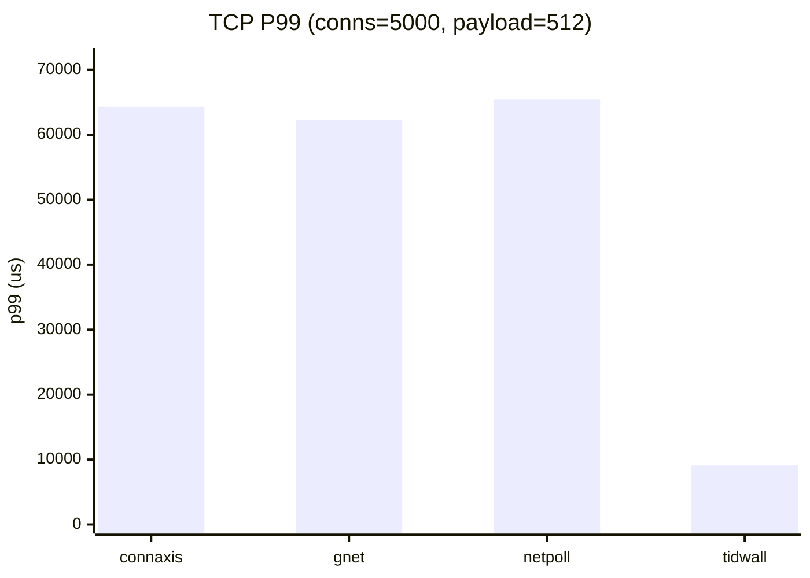
```mermaid
xychart-beta
    title "TCP P99 (conns=5000, payload=512)"
    x-axis [connaxis, gnet, netpoll, tidwall]
    y-axis "p99 (us)" 0 --> 71941
    bar [64300, 62300, 65400, 9100]
```

### HTTP Throughput (conns=5000, payload=0)

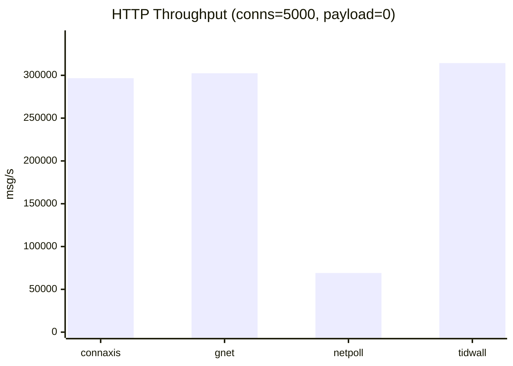
```mermaid
xychart-beta
    title "HTTP Throughput (conns=5000, payload=0)"
    x-axis [connaxis, gnet, netpoll, tidwall]
    y-axis "msg/s" 0 --> 345722
    bar [296673, 302386, 69093, 314291]
```

### HTTP P99 (conns=5000, payload=0)

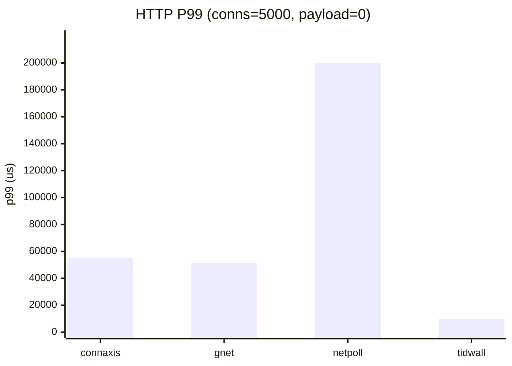
```mermaid
xychart-beta
    title "HTTP P99 (conns=5000, payload=0)"
    x-axis [connaxis, gnet, netpoll, tidwall]
    y-axis "p99 (us)" 0 --> 219891
    bar [55400, 51300, 199900, 9900]
```

### WS Throughput (conns=5000, payload=128)

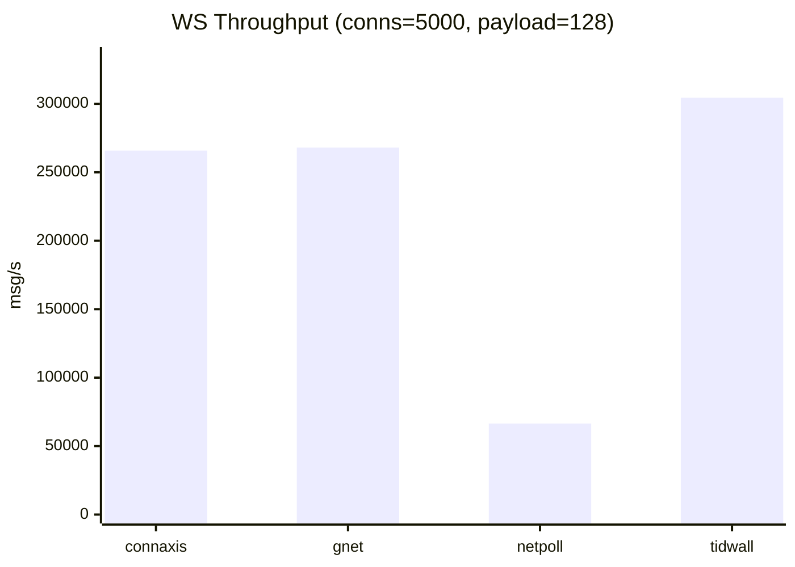
```mermaid
xychart-beta
    title "WS Throughput (conns=5000, payload=128)"
    x-axis [connaxis, gnet, netpoll, tidwall]
    y-axis "msg/s" 0 --> 334902
    bar [265833, 268007, 66485, 304455]
```

### WS Throughput (conns=5000, payload=512)

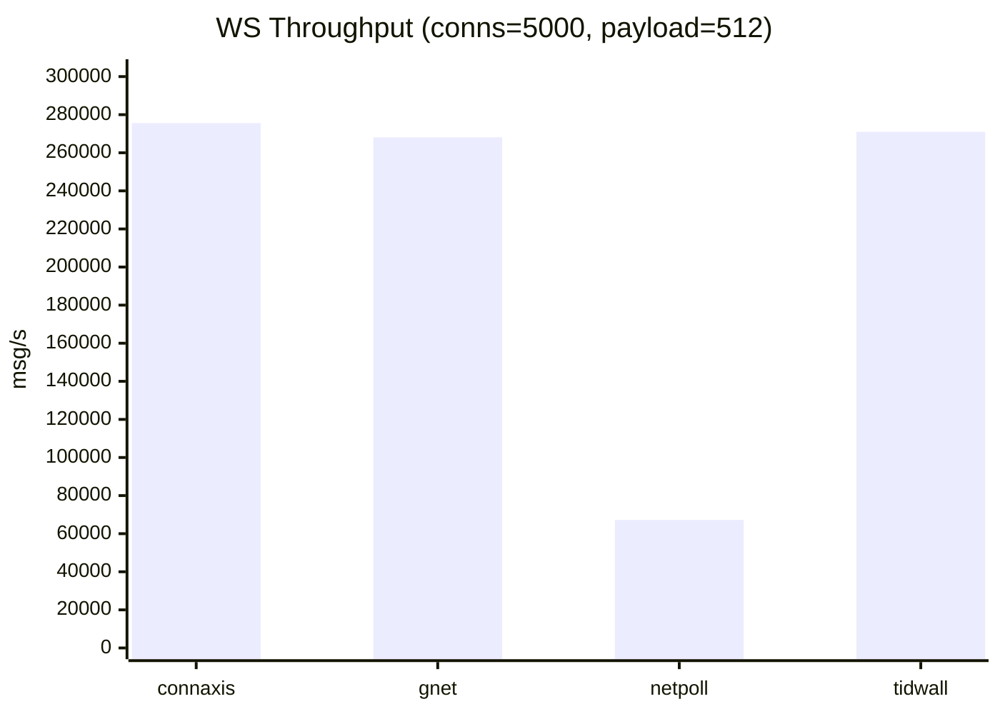
```mermaid
xychart-beta
    title "WS Throughput (conns=5000, payload=512)"
    x-axis [connaxis, gnet, netpoll, tidwall]
    y-axis "msg/s" 0 --> 303148
    bar [275588, 268140, 67234, 270979]
```

### WS P99 (conns=5000, payload=128)

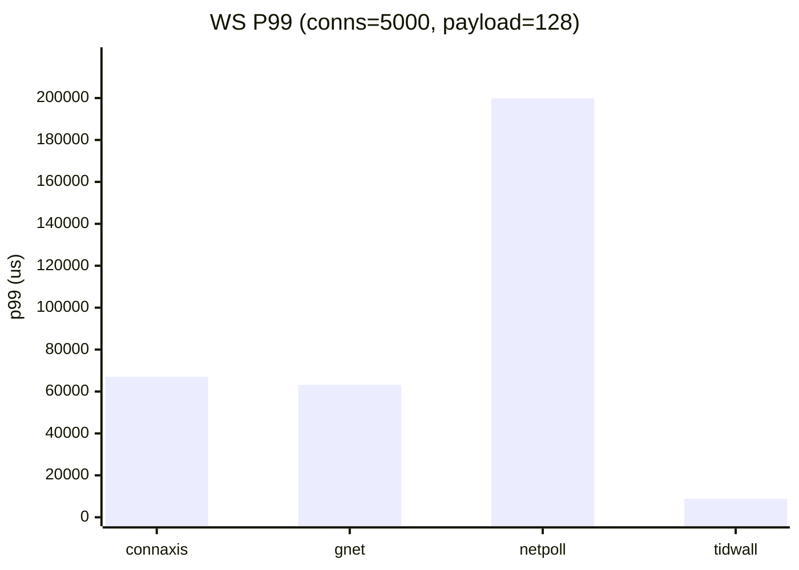
```mermaid
xychart-beta
    title "WS P99 (conns=5000, payload=128)"
    x-axis [connaxis, gnet, netpoll, tidwall]
    y-axis "p99 (us)" 0 --> 219891
    bar [67000, 63200, 199900, 8800]
```

### WS P99 (conns=5000, payload=512)

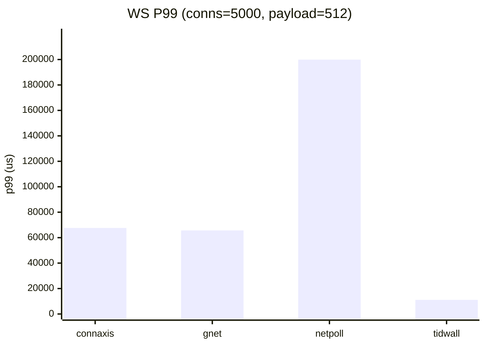
```mermaid
xychart-beta
    title "WS P99 (conns=5000, payload=512)"
    x-axis [connaxis, gnet, netpoll, tidwall]
    y-axis "p99 (us)" 0 --> 219891
    bar [67600, 65700, 199900, 11100]
```

### TLS Throughput (conns=5000, payload=128)

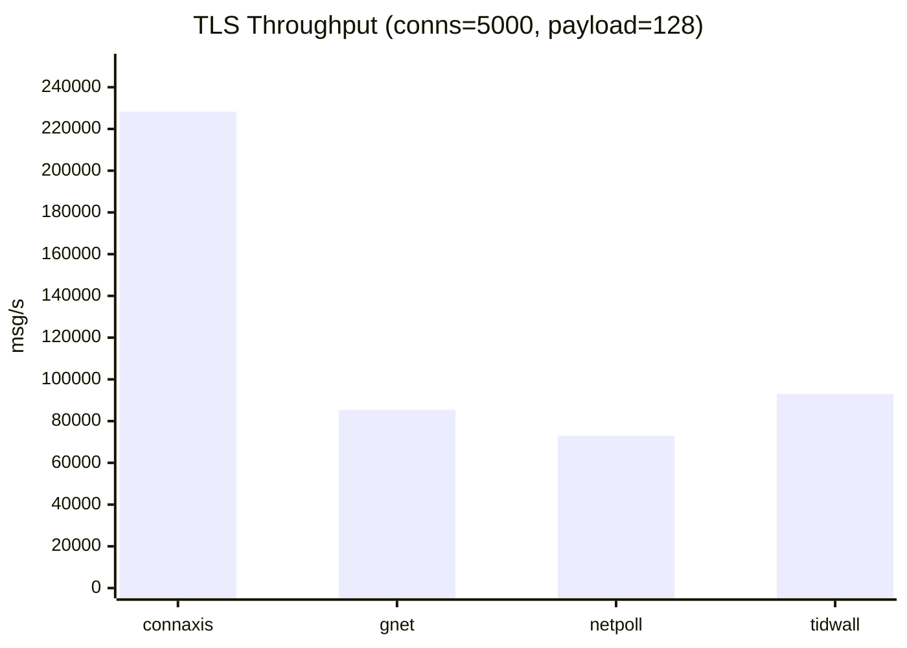
```mermaid
xychart-beta
    title "TLS Throughput (conns=5000, payload=128)"
    x-axis [connaxis, gnet, netpoll, tidwall]
    y-axis "msg/s" 0 --> 251090
    bar [228263, 85380, 72997, 92972]
```

### TLS Throughput (conns=5000, payload=512)

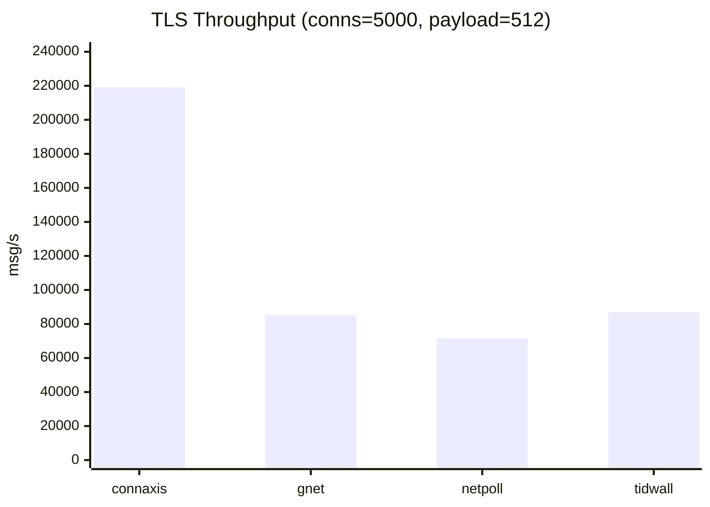
```mermaid
xychart-beta
    title "TLS Throughput (conns=5000, payload=512)"
    x-axis [connaxis, gnet, netpoll, tidwall]
    y-axis "msg/s" 0 --> 240970
    bar [219063, 85268, 71637, 87010]
```

### TLS P99 (conns=5000, payload=128)

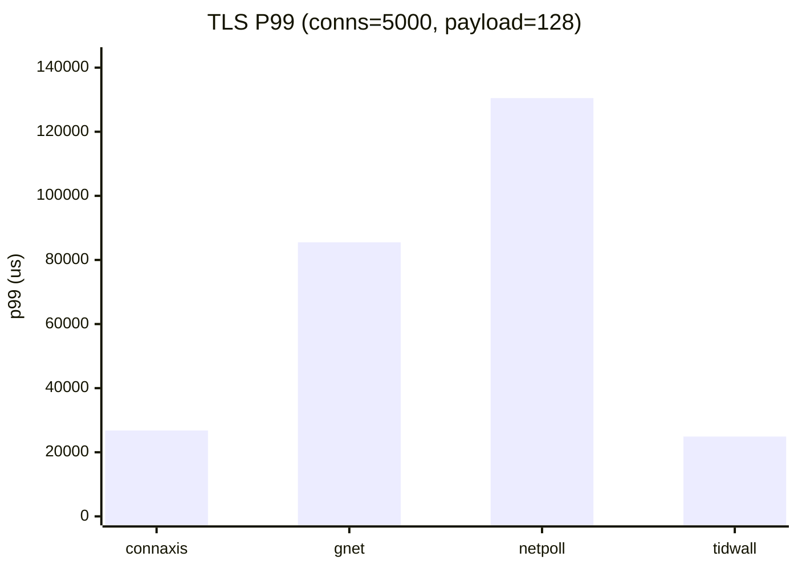
```mermaid
xychart-beta
    title "TLS P99 (conns=5000, payload=128)"
    x-axis [connaxis, gnet, netpoll, tidwall]
    y-axis "p99 (us)" 0 --> 143550
    bar [26800, 85500, 130500, 24900]
```

### TLS P99 (conns=5000, payload=512)

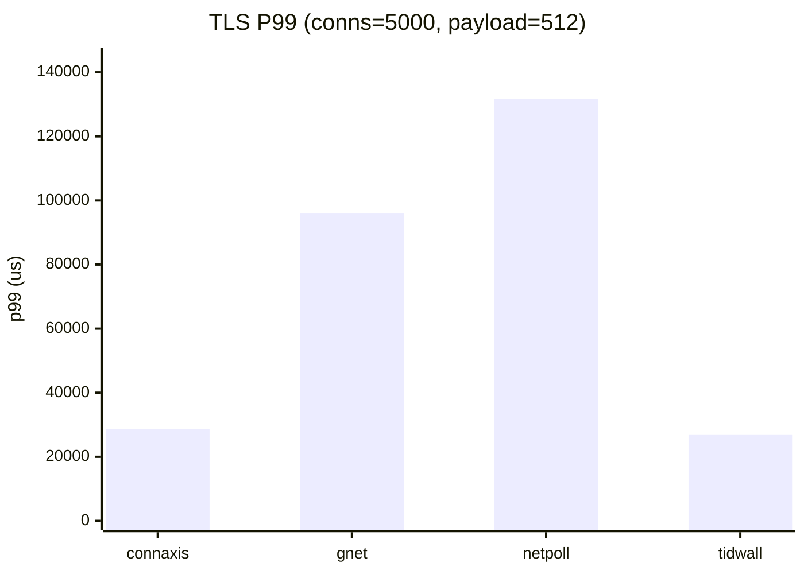
```mermaid
xychart-beta
    title "TLS P99 (conns=5000, payload=512)"
    x-axis [connaxis, gnet, netpoll, tidwall]
    y-axis "p99 (us)" 0 --> 144870
    bar [28700, 96100, 131700, 27000]
```

### WSS Throughput (conns=5000, payload=128)

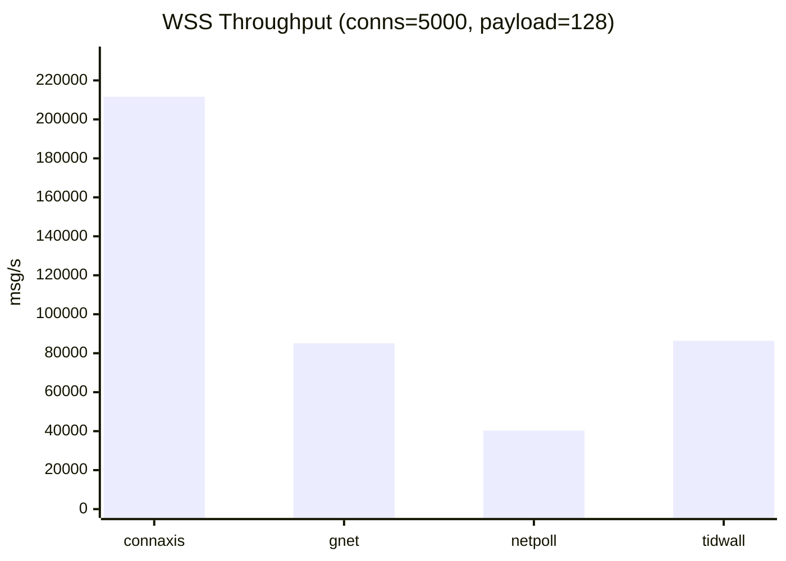
```mermaid
xychart-beta
    title "WSS Throughput (conns=5000, payload=128)"
    x-axis [connaxis, gnet, netpoll, tidwall]
    y-axis "msg/s" 0 --> 232809
    bar [211644, 85060, 40285, 86424]
```

### WSS Throughput (conns=5000, payload=512)

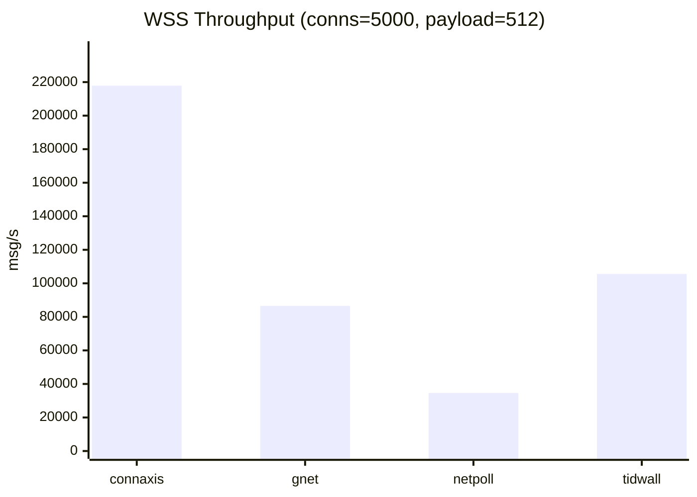
```mermaid
xychart-beta
    title "WSS Throughput (conns=5000, payload=512)"
    x-axis [connaxis, gnet, netpoll, tidwall]
    y-axis "msg/s" 0 --> 239664
    bar [217875, 86554, 34634, 105589]
```

### WSS P99 (conns=5000, payload=128)

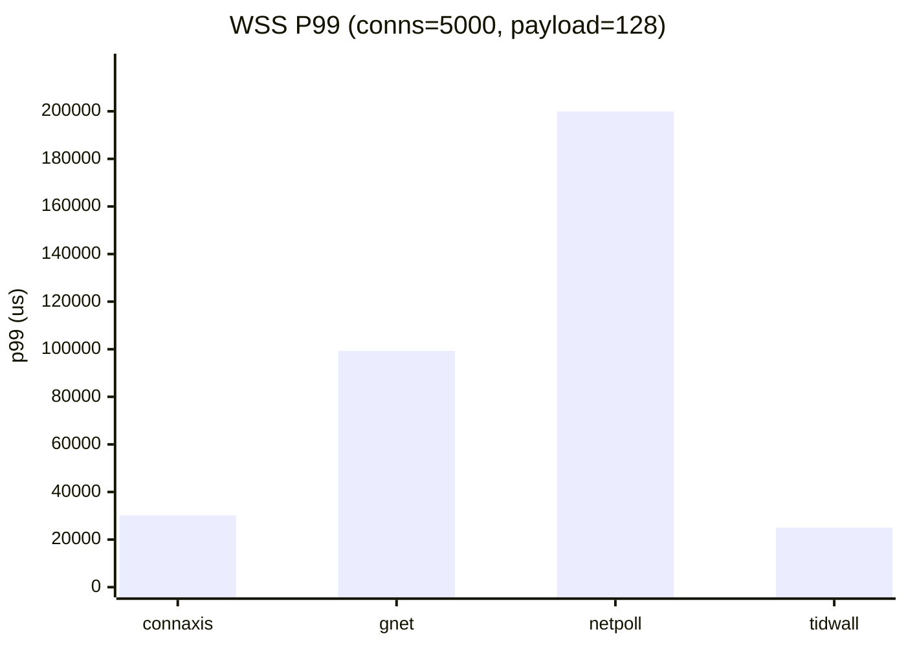
```mermaid
xychart-beta
    title "WSS P99 (conns=5000, payload=128)"
    x-axis [connaxis, gnet, netpoll, tidwall]
    y-axis "p99 (us)" 0 --> 219891
    bar [30200, 99300, 199900, 25000]
```

### WSS P99 (conns=5000, payload=512)

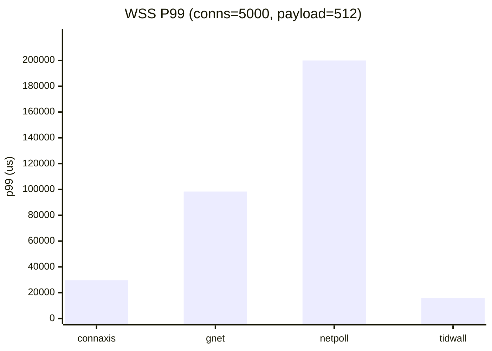
```mermaid
xychart-beta
    title "WSS P99 (conns=5000, payload=512)"
    x-axis [connaxis, gnet, netpoll, tidwall]
    y-axis "p99 (us)" 0 --> 219891
    bar [29700, 98400, 199900, 16000]
```
